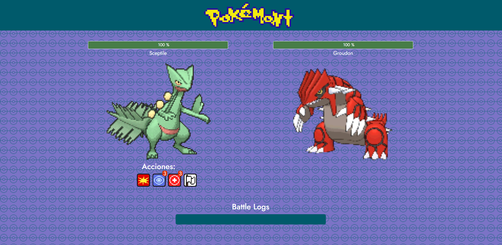

<p align="center"></p>
## enemy-Conqueror

Simple Vue js game
Demo link: https://enemy-conqueror.netlify.app/

## Project setup
```
yarn install
```

### Compiles and hot-reloads for development
```
yarn serve
```

### Compiles and minifies for production
```
yarn build
```

### Lints and fixes files
```
yarn lint
```

### Customize configuration
See [Configuration Reference](https://cli.vuejs.org/config/).
